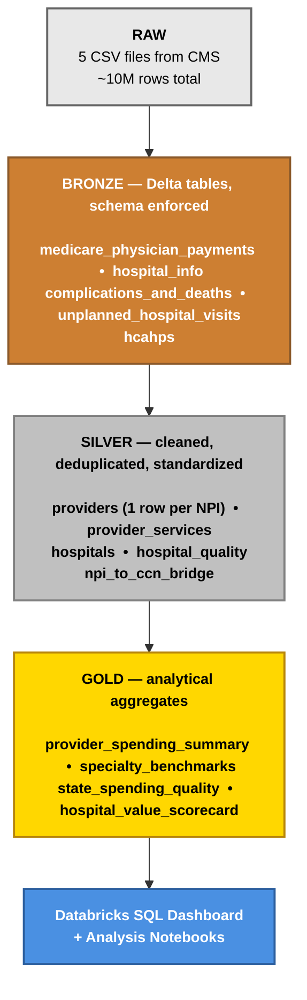

# Architecture

This project uses the medallion architecture pattern in Databricks — three Delta Lake table layers (bronze, silver, gold) with progressively more refinement at each layer. This document captures the layout and the reasoning behind it.

## The diagram



## Why medallion

The medallion pattern is the standard lakehouse architecture in Databricks, Snowflake, and pretty much every other major data platform that emerged in the last few years. It exists because moving raw data straight to analytics tables conflates three concerns that should be separate:

1. **Landing data reliably from external sources** (bronze)
2. **Cleaning and conforming it to business rules** (silver)
3. **Aggregating it for specific analytical questions** (gold)

Mixing these means every change to a business rule ripples back into your ingestion logic, every schema drift in a source file breaks your reports, and every new analytical question requires re-reading and re-cleaning the raw data. Separating the layers gives you the freedom to fix issues at the right level without breaking the others.

## What lives at each layer

### Bronze — raw landed as Delta

Bronze tables are nearly identical to the source CSVs. The only transformations:

- **CSV to Delta format.** Delta gives ACID transactions, schema enforcement, time travel, and faster reads. Once it's in Delta the raw CSV isn't read again.
- **Schema explicitly declared.** No `inferSchema=True` — every column gets a deliberate type at this layer. This catches CMS schema drift the moment it happens instead of silently coercing.
- **Ingestion metadata added.** A `_ingested_at` timestamp and `_source_file` column on every bronze table, for lineage.

Nothing else. No deduplication, no joins, no business logic. Bronze is the durable, replayable source of truth that everything downstream is derived from.

### Silver — cleaned and conformed

Silver is where the data becomes usable. The five silver tables and what each one handles:

- **`silver.providers`** — aggregates MUP-PHY from its NPI × HCPCS × place-of-service grain down to one row per NPI. Defines primary location and primary specialty for providers who bill from multiple locations or under multiple specialty codes.
- **`silver.provider_services`** — the line-item version of MUP-PHY, cleaned but not aggregated. Used for analyses that need per-service granularity.
- **`silver.hospitals`** — cleaned hospital reference, filtered to acute care hospitals only. Adds normalized address fields for downstream matching.
- **`silver.hospital_quality`** — unifies three quality bronze tables (`complications_and_deaths`, `unplanned_hospital_visits`, `hcahps`) into one long-format hospital × measure table, filtered to ~12 high-signal measures.
- **`silver.npi_to_ccn_bridge`** — derives an NPI ↔ CCN match table through exact address matching, since CMS doesn't publish a direct linkage.

Silver tables are what an analyst would query if they wanted "the cleaned data." They're not pre-aggregated for any specific question.

### Gold — analytical aggregates

Gold tables answer specific business questions. Each one is denormalized for dashboard reads, with derived analytical columns pre-computed:

- **`gold.provider_spending_summary`** — one row per individual NPI with payment rank (nationwide, within-specialty, within-state) and percentile pre-computed. The "who are the highest-spending providers" table. Building this surfaced a real CMS data pattern: in some specialties (Nurse Practitioner most visibly), the top NPIs reflect organizational billing aggregation rather than individual physician earnings.
- **`gold.specialty_benchmarks`** — one row per specialty with median, P25/P75/P95, max payment, and a top-1% spending concentration ratio. Built on medians rather than means specifically because the organizational-billing pattern would distort mean-based metrics. The concentration ratio metric exposes that pattern as a numeric signature — normal specialties show 10-15% concentration at the top 1%, the affected specialties show 20-30%.
- **`gold.state_spending_quality`** — one row per state with spending and quality side-by-side, aggregated independently at state grain (no row-level join needed). Reveals what the literature has been saying for two decades: state-level quality variation is small (~10% range), state-level spending variation is large (~70% range).
- **`gold.hospital_value_scorecard`** — one row per hospital (matched via the bridge) with spending intensity, all 12 quality measures, a composite mortality score, and a `value_quadrant` label (high/low cost × high/low quality). The headline table for the project's central business question. The four quadrants come out roughly equal — about half of US hospitals are value-mismatched in one direction or the other.

Gold tables are denormalized on purpose. They're optimized for being read by dashboards and notebooks, not for being maintained as part of a normalized schema.

## Why Delta Lake specifically

Three reasons that matter for this project:

1. **Schema enforcement at write time.** When CMS publishes a new file with a renamed column, the write fails loudly instead of silently producing nulls. That's exactly what you want in a pipeline that runs once a year on data that periodically changes shape.
2. **Time travel.** Every transformation creates a new version. If I run the silver pipeline and discover it dropped 200 NPIs incorrectly, I can query the previous version and figure out what changed without re-ingesting from source.
3. **ACID transactions.** Spark jobs that partially fail don't leave the table in a corrupt half-written state. This stops mattering at toy scale and starts mattering at 9M-row scale.

The alternative would be Parquet files in a bucket with manual metadata management. That's how data lakes worked five years ago. Delta is what made the "lakehouse" idea actually viable.

## Catalog and schema layout

Inside Databricks, the layout will use Unity Catalog with the three layers as schemas under a single catalog:

```
medicare_provider_quality (catalog)
├── bronze (schema)
│   ├── medicare_physician_payments
│   ├── hospital_info
│   ├── complications_and_deaths
│   ├── unplanned_hospital_visits
│   └── hcahps
├── silver (schema)
│   ├── providers
│   ├── provider_services
│   ├── hospitals
│   ├── hospital_quality
│   └── npi_to_ccn_bridge
└── gold (schema)
    ├── provider_spending_summary
    ├── specialty_benchmarks
    ├── state_spending_quality
    └── hospital_value_scorecard
```

Three-part naming (`catalog.schema.table`) is the Unity Catalog convention and lets you reference tables unambiguously across the workspace. Even on Databricks Free with a single workspace it's worth doing properly — it's the same pattern used in production environments and it costs nothing to set up correctly the first time.

Raw CSVs will land in a Databricks Volume (`medicare_provider_quality.raw.landing`) before being read into bronze. Volumes are Unity Catalog's mechanism for managing files alongside tables, and using one keeps the entire pipeline inside Unity governance rather than relying on DBFS or external storage.

## What this architecture deliberately does not do

A few things that might look like omissions:

- **No streaming.** CMS publishes annually. Streaming infrastructure for an annual file would be theater. Batch with Auto Loader is the right pattern here.
- **No CDC.** The data doesn't update — each year's release is a complete snapshot. SCD type 2 patterns will be discussed in the silver layer (year-over-year provider tracking) but aren't needed for the core pipeline.
- **No real-time serving.** The dashboard reads from gold tables, which are refreshed when the pipeline runs. That's the right granularity for annual data.

These are decisions, not gaps. Building infrastructure that doesn't match the actual data refresh cadence is a common mistake and worth flagging up front.

## Reproducibility

The full pipeline will be reproducible by running the notebooks in order:

1. Ingestion notebook (raw CSV → bronze)
2. Silver transformation notebooks
3. Gold aggregation notebooks
4. Analysis notebooks

Each notebook will be idempotent — running it twice produces the same result as running it once. Non-idempotent pipelines are a common source of bugs that only surface on re-runs, after the original author has moved on to other work.
